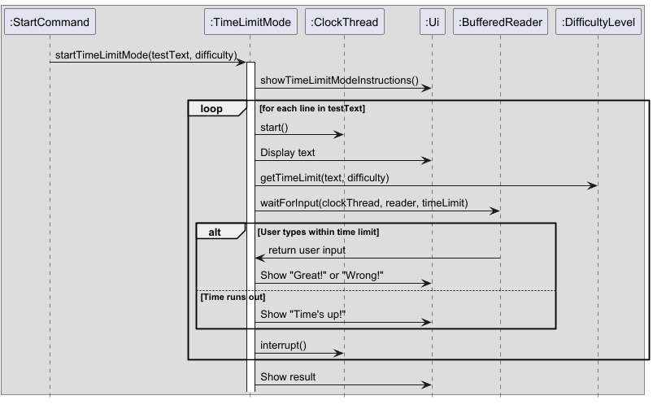

# Developer Guide

## Acknowledgements

The format of the Developer Guide and User Guide were inspired and adapted from [addressbook-level3](https://github.com/se-edu/addressbook-level3).

The sample texts used in BoboType were generated using ChatGPT, an AI language model developed by OpenAI.

## Design
### Architecture

The ***Architecture Diagram*** given above explains the high-level design of BoboType.

**Main components of the architecture**

### Ui Component

The API of this component is specified in `Ui.java`.

### Command Component
The API of this component is specified in `Command` package

The class diagram of `Command` is shown below.

## Logic

Here’s a (partial) class diagram of the parsing logic:

### Storage
The API of this component is specified in `Storage.java`.
The class diagram of `Storage` is shown below.

## Implementation

### Normal Mode Feature

#### Implementation

Normal Mode is facilitated by `NormalMode`. Additionally, it implements the following operations:

- `NormalMode(Ui ui, Scanner sc, TypingTargetList typingTargetList, State state, AutoAdjust autoAdjust, TypingAccuracy typingAccuracy)` - Constructor to create a NormalMode object.
- `startNormalMode(List<String> testText)` - Runs the normal typing test, displaying test text, tracking user input, and computing typing statistics.

Usage Scenario

Given below is an example usage scenario and how the Normal Mode behaves at each step.

Step 1: The user selects Normal Mode from the available practice modes, instantiating a NormalMode object and running `startNormalMode()`. The method displays instructions and initializes counters.

Step 2: The first line of the test text is displayed to the user. The TypingTimer starts tracking time.

Step 3: The user types their response, which is recorded and analyzed. `TypingAccuracy.updateUserInput()` updates accuracy tracking. `WordCounter.countWords()` calculates the number of words typed, and the character count is updated accordingly.

Step 4: The process repeats for each line in the test text until all lines have been typed.

Step 5: The typing timer stops, and the typing statistics are calculated:

- Words per minute (WPM)
- Characters per minute (CPM)
- Typing accuracy
- Overall typing score (calculated using WPM and accuracy)

These results are displayed using UI methods (`ui.showTypingSpeedWPM()`, `ui.showTypingSpeedCPM()`, `ui.showTypingAccuracy` and `ui.showTypingScore()`).

Step 6: The program checks if the user has met any predefined typing targets stored in TypingTargetList:

- If the user meets a speed target (`TypingTargetSpeed`), it is marked as hit.
- If the user meets a score target (`TypingTargetScore`), it is marked as hit.
- The system displays feedback on whether each target was met.

Step 7: The AutoAdjust system evaluates the user’s typing speed and provides feedback to adjust difficulty.

Step 8: The user's high score is updated using state.updateHighScore(). If an error occurs while updating the score, an error message is displayed.

Step 9: The user returns to the main menu after reviewing their results.

Below is the sequence diagram of normal mode.

### TimeLimit Mode Feature

#### Implementation

TimeLimit Mode is facilitated by `TimeLimitMode`. Additionally, it implements the following operations:

- `TimeLimitMode(Ui ui, Scanner sc)` - Constructor to create TimeLimitMode object
- `startTimeLimitMode(List<String> testText, DifficultyLevel difficulty)` - Runs the time-limited typing test, displaying test text, tracking user input, and enforcing a time limit.
- `waitForInput(ClockThread clockThread, BufferedReader reader, long timeLimit)` - Waits for user input within the given time limit and returns the typed text.
- `getNumOfCorrect()` - Returns the number of correctly typed lines.
- `getNumOfLines()` - Returns the total number of lines in the test text.
- `getTimeLimit(String s, DifficultyLevel difficulty)` - Determines the time limit for each line based on its word count and difficulty level.

Additionally, the ClockThread class is implemented as a separate thread to track elapsed time:

- `run()` - Starts a timer and keeps updating elapsed time until interrupted.
- `getElapsedTime()` - Returns the elapsed time in seconds.

Given below is an example usage scenario and how the Time Limit Mode behaves at each step.

Step 1: The user selects Time Limit Mode from the available practice modes, instantiating a `TimeLimitMode` object and running `startTimeLimitMode()`. The method displays instructions and initializes counters.

Step 2: The first line of the test text is displayed to the user. A ClockThread instance starts running to track elapsed time.

Step 3: The user types their response. The program waits for input while checking if the elapsed time exceeds the time limit using `waitForInput()`. If input is provided before the time limit, it is validated against the expected text.

Step 4: If the input matches the expected text, the correct count increases, and a success message is displayed. Otherwise, an error message is shown.

Step 5: If the user fails to respond within the time limit, a timeout message is displayed.

Step 6: The process repeats for each line in the test text. After all lines are completed, the final result is displayed using `ui.showTimeLimitResult()`.

Step 7: The user presses Enter to return to the main menu.

Below is the sequence diagram of time limit mode.

### Zen Mode Feature

#### Implementation

Zen Mode is facilitated by `ZenMode`. Additionally, it implements the following operations:

- `ZenMode(TypingTimer typingTimer,Scanner sc, Ui ui)` - Constructor to create ZenMode object
- `startZenMode()` - Runs input loop to read user input and compute typing statistics

Given below is an example usage scenario and how the Zen Mode behaves at each step.

Step 1. The user selects Zen Mode when selecting the practice mode, instantiating a `ZenMode` object and running
`startZenMode()`. `startZenMode()` starts `typingTimer` and reads user input.

Step 2. The user types `I am typing a sample text here`, calling `wordCounter.countWords` to count the number of words
in the user's input and adds to the `wordCount`.

Step 3. The user types `stop_practice`, ending the loop and computes the typing speed. stop_practice is included in the
word count as the timer runs until the user enters stop_practice.

Step 4. The typing practice results is displayed to the user with `UI.showZenModeEndGame`

Below is the simplified sequence diagram for ZenMode

##### Design Considerations:

**Aspect: How to measure word count:** 

- **Alternate 1 (current choice):** Include stop_practice in word count
  - Pros: Easy to implement
  - Cons: May be confusing to users
- **Alternate 1 (current choice):** Do not include stop_practice in word count
  - Pros: Less confusing to users
  - Cons: Less accurate word count and WPM

### Custom Mode Feature

#### Implementation

Custom Mode is facilitated by `CustomMode`.
Additionally, it implements the following operations:

- `CustomMode(Ui ui, Scanner sc)` - Constructor to create CustomMode object
- `startCustomMode()` - Runs input loop to read user input and compute typing statistics
- `inputUserText()` - creates a file to store the user's custom text input and puts them into an ArrayList<String>.

Given below is an example usage scenario and how the Custom Mode behaves at each step.

Step 1. The user selects Custom Mode when selecting the practice mode, instantiating a `CustomMode` object and running
`startCustomMode()`.

Step 2. Custom mode requires the user to input a custom text to be tested on.

Step 3. The user types `exit`. The loop ends and the user's custom text is saved to a file.

Step 4. Typing Practice will start for the user, using the custom text they inputted.

Step 5. The user completes the round and the words per minute (wpm) and characters per minute (cpm)
are calculated and displayed to the user.

Given below is the Class diagram of CustomMode

### Typing Targets Feature

#### Proposed Implementation

Typing Targets are facilitated by `TypingTargetList`, `TypingTarget`, `TypingTargetSpeed`, and `TypingTargetScore`.
`TypingTargetList` contains various `TypingTarget` instances, which can be of class `TypingTargetSpeed` or
`TypingTargetScore`.

The user can issue the command `targetspeedadd` or `targetscoreadd` to add a typing target for speed or score
respectively. When the target is hit when the user finishes a `normal` typing test, the program will inform the user
that their target has been successfully reached.

### Milestones Feature

#### Implementation

Milestones are facilitated by `Milestones` and managed in coordination with `AutoAdjust`.
Additionally, it implements the following operations:

- `Milestones(String filePath)` - Loads milestone progress from a file (or initializes it if not found).

- `checkAndUpdate(String difficulty, double wpm)` - Checks whether the user has hit the milestone (e.g., 60 WPM in easy)
  and updates their progress if so. Promotes to the next difficulty and writes to file.

- `getCurrentDifficulty()` - Returns the current default difficulty that will be suggested for practice.

- `evaluate(int wpm)` - Invokes checkAndUpdate to determine whether the user should be promoted. If a milestone is hit,
  the user is congratulated with Ui.showMilestoneAchieved.

Given below is an example usage scenario of how Milestones feature behave at each step.
Step 1. The user starts a practice session in normal or timedLimit mode. `Milestones.getCurrentDifficulty()` is used to
determine their default difficulty (e.g., "easy").

Step 2. The user completes the round and achieves a sufficiently high WPM (e.g., 61 WPM in easy mode).
`AutoAdjust.evaluate(wpm)` is called at the end of the session.

Step 3. `Milestones.checkAndUpdate(difficulty, wpm)` checks if the user qualifies for a milestone. Since 61 WPM is the
goal for "easy"(60), the milestone is achieved.

Step 4. The Milestones class promotes the user to the next difficulty (e.g., from "easy" to "intermediate") and updates
`data/milestones.txt`.
`Ui.showMilestoneAchieved(...)` is then called to notify the user of their achievement and promotion.

### Highscore List Feature

#### Implementation

Highscore List is facilitated by `highScoreList` and managed in coordination with `Highscore`.
Additionally, it implements the following operations:

- `getHighscoreList()` - loads the highscore list from storage file.
- `saveScoreList(ArrayList<Double> newHighScoreList)` - saves the highscore list to storage file.
- `readHighScoreList()` - reads the highscore list from storage file.
- `updateHighScore(Double accuracy, int wpm)` - highscore is calculated by WPM * typingAccuracy.
  Updates the highscore list by adding the new highscore to the list.
  Then sorting the list into the top 3 highscores.
- `showHighscoreList()` - displays the highscore list to the user.

Given below is an example usage scenario of how Highscore List feature behave at each step.

Step 1. The user starts a practice session in normal mode.

Step 2. The user completes the round, typing accuracy and words per minute (wpm) are calculated.

Step 3. `state.updateHighscoreList(typingAccuracyDouble, typingSpeedWPM)` adds the new highscore to the highscore list.
Then, the list is sorted into the top 3 highscores.

### Highscore Feature

#### Implementation

Highscores are facilitated by `Highscores` and managed in coordination with `TypingTest`.
Additionally, it implements the following operations:

- `getHighscore()` - loads the top highscore from the highscore List.
- `updateHighscore(Double accuracy, int wpm)` - updates the highscore list by adding the new highscore to the list.
  Then sorting the list into the top 3 highscores.
- `showHighscore()` - displays the highscore to the user.

Given below is an example usage scenario of how Highscore feature behave at each step.

Step 1. The user starts a practice session in normal mode.

Step 2. The user completes the round, the typing accuracy and words per minute (wpm) are calculated.
`state.updateHighscore(typingAccuracyDouble, typingSpeedWPM)` is called at the end of the session.

Step 3. `state.updateHighscore(typingAccuracyDouble, typingSpeedWPM)` adds the new highscore to the highscore list.
Then, the list is sorted into the top 3 highscores.

Step 4. `getHighscore()` will take the top highscore in the highscore list and save it.

Step 5. `state.showHighscore()` displays the highscore to the user.

### Typing Accuracy

#### Implementation

The typing accuracy of the user is facilitated by `TypingAccuracy`. It implements the following operations:
- `TypingAccuracy(ArrayList<String> userText)` - Constructor to create TypingAccuracy object with user input
- `setTestText` - Set's the test text to the corresponding text being tested
- `updateUserInput` - Update's the user input when they type a new line
- `getTypingAccuracy` - Computes and returns typing accuracy

Below is the sequence diagram for `TypingAccuracy`

#### Design Considerations

**Aspect: How to measure typing accuracy**

- **Alternative 1 (current choice):** Measure typing accuracy only up to the test text or user input depending on which
  input is shorter
  - **Pros:** Easier to implement
- **Alternative 2:** Always measure to the end of user input and penalise for additional words
  - **Pros:** More accurate comparison between user and test text
  - **Cons:** Less intuitive for users

**Aspect: When to measure typing accuracy**

- **Alternative 1 (current choice):** Only measure typing accuracy in normal mode
  - **Pros:** More streamlined for users
  - **Cons:** Less information for users in other mods
- **Alternative 2:** Measure typing accuracy in all modes
  - **Pros:** More options available for users
  - **Cons:** Shows redundant information (e.g. You must achieve 100% accuracy in TimeLimit mode to pass anyway)

### Progress Report
#### Implementation

Progress Report is facilitated by `ProgressReport`.
Additionally, it implements the following operations:

- `update(double score)` - adds the latest's session score to the list and saves it to the `progress.txt` file. Removes 
the oldest entry if maximum number of stored sessions (10) is exceeded. Also increments a `sessionCounter`. 
- `show()` - displays the most recent 10 attempts from normal mode only in a text-based vertical bar graph.

Given below is an example usage scenario and how Progress Report behaves at each step.

Step 1. The user starts a practice session in normal mode.

Step 2. The user completes the round and `update(double score)` adds the new score to the list of past 10 practices.

Step 3. `sessionCounter` is incremented to track the total number of sessions ever played, with progress data 
persistently stored in `progress.txt`.

Step 4. When user inputs the command `progress`, `show()` displays the past 10 session scores as a vertical bar graph 
with corresponding session numbers.

### Storage
#### Implementation

Storage is facilitated by `Storage` and `State`.
Storage handles the reading and writing of data to and from files, while State manages the application state.
Additionally, it implements the following operations:
- `Storage(String filePath)` - Constructor to create Storage object with the specified file path.
- 'saveScoreList(ArrayList<Double> newHighScoreList)` - Saves the highscore list to the specified file.'
- `readHighScoreList()` - Reads the highscore list from the specified file.

State manages the application state and implements the following operations:
- `State(Storage storage)` - Constructor to create State object with the specified Storage object.
- `getHighScore()` - Returns the highscore.
- `getHighScoreList()` - Returns the highscore list.
- `UpdateHighScore(Double accuracy, int wpm)` - Updates the highscore list with the new score.

Below is a class diagram of Storage and State.

#### Design Considerations

**Aspect: How to display progress data**

- **Alternative 1:**  Display a list of scores from past runs in a simple table format
  - **Pros:** Easier to implement and simple to read
  - **Cons:** Less visual, harder for users to spot trends at a glance
- **Alternative 2 (current choice):** Text-Based Vertical Bar Graph
  - **Pros:** More visually engaging, allows users to quickly and easily observe trends
  - **Cons:** Slightly harder to implement due to bar scaling

**Aspect: How many past sessions to display**

- **Alternative 1:** List out data of all sessions
  - **Pros:** Provides user with a comprehensive understanding of their progress from the start
  - **Cons:** Can be overwhelming or cluttered, especially with many sessions
- **Alternative 2 (current choice):** Show past 10 sessions
  - **Pros:** More intuitive and easy for users to view and digest information
  - **Cons:** Requires additional logic for tracking and maintaining session count

## Appendix: Requirements

### Product scope

#### Target user profile

Has a desire to improve typing speed and accuracy.

Prefers desktop applications to web or mobile apps.

Enjoys or is comfortable using Command-Line Interface (CLI) tools.

Prefers keyboard-based interactions to mouse navigation.

Is motivated by progress tracking, stats, and milestone achievements.

#### Value proposition

Helps users practice and improve typing in a distraction-free CLI environment by offering a faster,
lightweight alternative to bloated GUI typing apps, ideal for keyboard-centric users.

### User Stories

| Version | As a ...         | I want to ...                                                                      | So that I can ...                                                 |
|---------|------------------|------------------------------------------------------------------------------------|-------------------------------------------------------------------|
| v1.0    | slow typer       | practise typing with different texts                                               | improve my typing speed                                           |
| v1.0    | user             | have various lengths for typing tests                                              | spend as little or as much time I want practising                 |
| v1.0    | user             | adjust the difficulty level of typing exercises                                    | challenge myself appropriately as I improve over time             |
| v1.0    | user             | track my typing speed                                                              | know how fast I can type                                          |
| v1.0    | user             | track my typing accuracy                                                           | know how accurately I can type                                    |
| v1.0    | user             | track my typing high score                                                         | track my personal best and attempt to break it                    |
| v2.0    | goal-driven user | set specific targets for typing speed and scores and get notified when I hit them  | keep track of my progress and goals                               |
| v2.0    | unmotivated user | have timed tests                                                                   | be motivated to type faster each time                             |
| v2.0    | user             | type my own words (zen mode)                                                       | train using my own texts                                          |
| v2.0    | user             | have a tool that auto-adjusts my exercises' difficulty based on my experience      | gradually improve as the difficulty increases with my skill level |
| v2.0    | user             | track milestones I achieve                                                         | keep track of my progress and give myself a sense of achievement  |
| v2.0    | user             | view the top 3 highscores                                                          | keep track of my progress and past performances.                  |
| v2.1    | user             | practice typing with custom text                                                   | improve my typing speed and accuracy using my own text            |

### Non-Functional Requirements

1. Should work on any mainstream OS as long as it has Java 17 or above installed.
2. A user with above average typing speed for regular English text (i.e. not code, not system admin commands) should
   be able to accomplish most of the tasks faster using commands than using the mouse.

### Glossary

- Mainstream OS: Windows, Linux, Unix, MacOS
- WPM (Words Per Minute): A measure of typing speed, indicating how many words a user types per minute.
- CPM (Characters Per Minute): A measure of typing speed based on the number of characters typed per minute.
- score: WPM * Accuracy 

## Appendix: Instructions for manual testing

Given below are instructions to test the app manually.

Note: These instructions only provide a starting point for testers to work on; testers are expected to do more
exploratory testing.

### 1. Launch and Shutdown

#### Initial Launch

1. Download the executable JAR file and place it in an empty folder.

2. Open a terminal or command prompt and navigate to the folder containing the JAR file.

3. Run the command: `java -jar BoboType.jar`.

Expected: The CLI interface should launch, displaying the welcome message and available commands.

#### Saving Session Data

1. Start a typing session.

2. Complete a few exercises and exit the application using the exit command.

3. Restart the application with `java -jar BoboType.jar`.

Expected: User progress and settings from the previous session should be retained.

### 2. Typing Exercises

#### Starting a Typing Test

1. Run the command: `start`

Expected: A typing prompt should appear with a sample text to type.

#### Completing a Typing Test

1. Type the displayed text correctly and press `Enter`.

Expected: The app should calculate and display typing speed (WPM) and accuracy percentage.

#### Handling Incorrect Inputs

1. Enter a completely incorrect text and press `Enter`.

Expected: The app should highlight mistakes and display an accuracy score below 100%.

2. Enter an empty input and press `Enter`.

Expected: The app should display an error message indicating that input cannot be empty.

3. Enter special characters not present in the prompt.

Expected: The app should ignore or flag them as incorrect input.

### 3. Custom Mode

#### Starting a Custom Typing Test

1. Run the command: `custom`

Expected: The app should prompt the user to type the previously added custom text.

### 4. Progress Tracking

#### Viewing Progress

1. Run the command: `progress`

Expected: The app should display the past 10 typing scores.

#### Resetting Progress

1. Run the command: `resetprogress`

Expected: The app should reset all stored progress and confirm the reset.

### 5. Error Handling & Edge Cases

#### Invalid Commands

1. Enter a random text.

Expected: The app should display an error message stating that the command is invalid.

2. Enter an incomplete command.

Expected: The app should provide a suggestion or display the correct command usage.

#### Corrupted Data Handling

1. Manually edit the saved progress file and enter invalid values.

2. Restart the application.

Expected: The app should detect corruption and either reset progress or notify the user of an error.

### 6. Exiting the Application

#### Using the exit Command

1. Run the command: `exit`

Expected: The application should close cleanly without errors.

#### Forcing Shutdown

1. Close the terminal without using the `exit` command.

2. Reopen the application.

Expected: The app should start normally without corruption or data loss.
